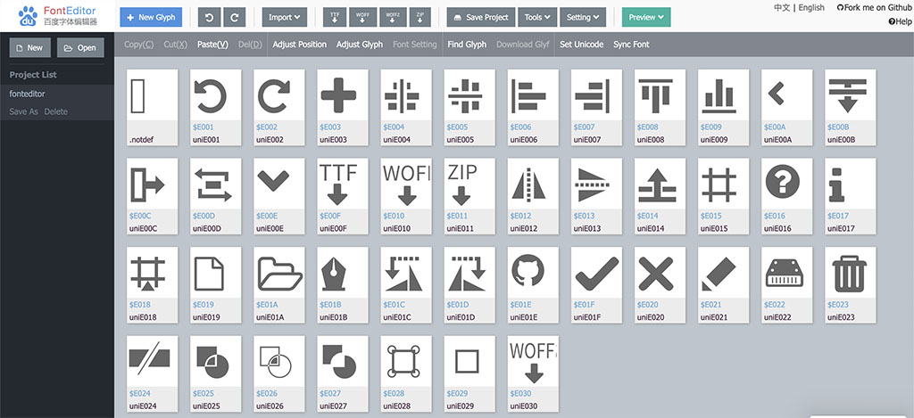

Fonteditor Online Font Editor
==========

[English](./README.md) | [中文](./README.zh-CN.md)

Use `Fonteditor` to edit, transform, preview fonts.

Support ttf, woff, woff2, otf, svg font, eot import and edit online.

[English Version](https://kekee000.github.io/fonteditor/index-en.html)

[Fontstore](http://fontstore.baidu.com/static/editor/index.html)



### Dev:

```
npm install && npm run dev
```

* Main entry template is `index.tpl`， using `index.tpl` to generate `index.html` and `index-en.html`.
* Jszip 3.0 api has changed, currently use lower version of jszip.

### Build:

```
npm run build
```

### Test:

```
npm run test
```

### Demo:

```
npm run demo
```

### Relative

+ Fonteditor Core Lib: [fonteditor-core](https://github.com/kekee000/fonteditor-core)
+ fontmin: [fontmin](https://github.com/ecomfe/fontmin)

